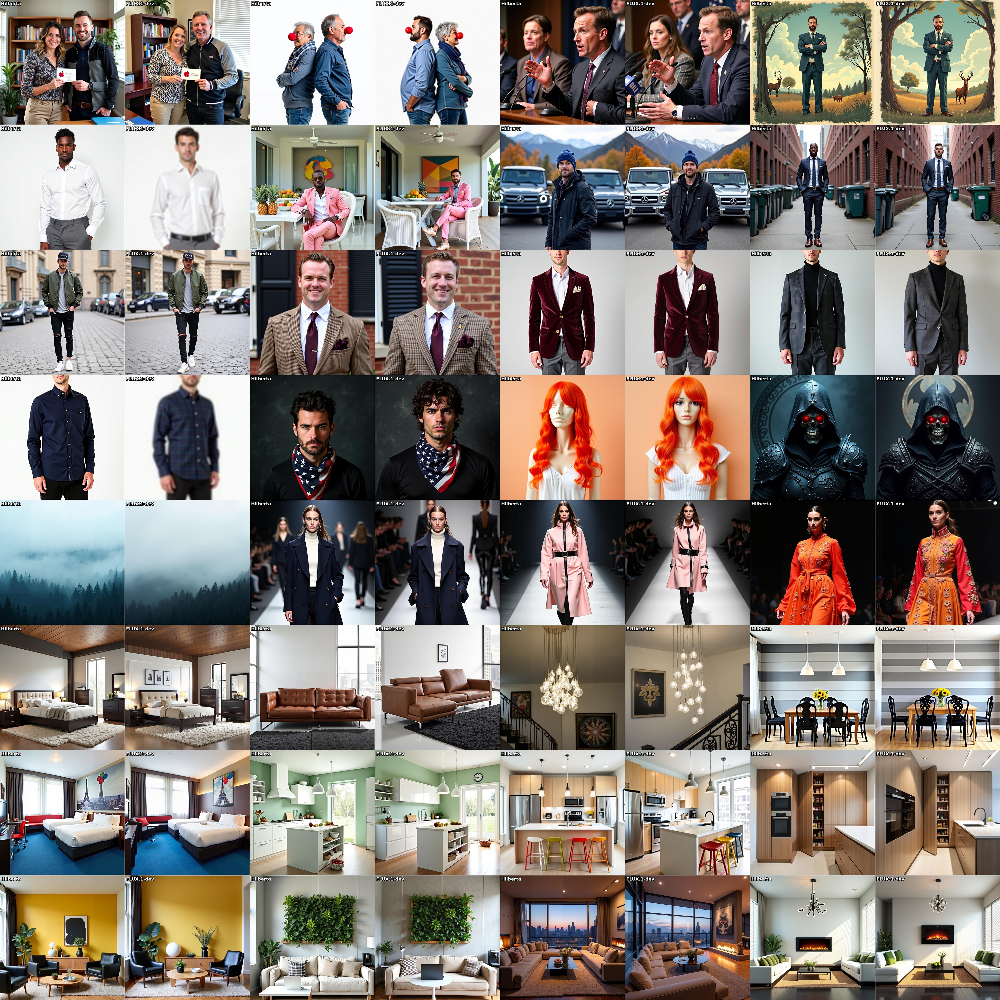
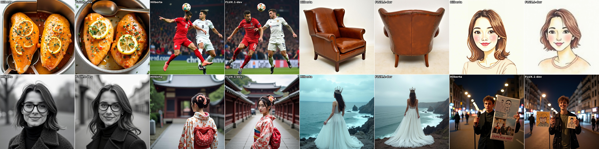

# HilbertA on t2i-prompts-3m vs. Flux.1-dev

Here we show 200 samples generated from real-world user prompts drawn from t2i-prompts-3m (Chen et al., 2025), a diverse collection of practical text-to-image prompts. Results are randomly sampled without any cherry-picking. Each row displays four image pairs: with in each pair, **HilbertA** on the left, **Flux.1-dev** on the right.

Images in [`imgs/2_t2iprompt200/`](imgs/2_t2iprompt200/).

