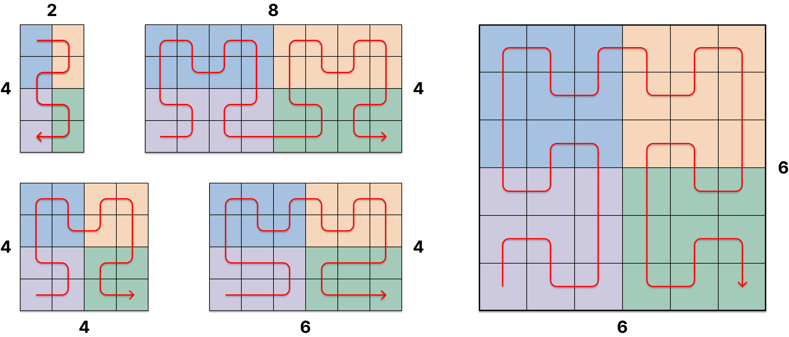

# Hilbert Curve Extension to Non-power-of-two Grids

## Examples

Generalized Hilbert curves on non-power-of-two grids. We show five examples at increasing size: 2×4, 8×4, 4×4, 6×4, and 6×6. In all cases, the curve visits every cell exactly once with orthogonal steps, and spatial neighbors remain close in the 1D sequence order. When both dimensions are powers of two (4×4), the standard Hilbert curve is recovered. 

